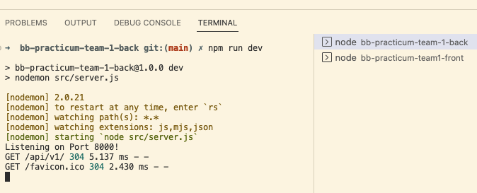

# Back-End Repo for Team 1 of Baboon/Bald Eagle Practicum

This will be the API for bb-practicum-team1-front React app.

These instructions are for the **front-end team** so they can setup their local development environment to run
both the back-end server and their front-end app. You can go through these steps during your first group meeting
in-case you need assistance from your mentors.

> The back-end server will be running on port 8000. The front-end app will be running on port 3000. You will need to run both the back-end server and the front-end app at the same time to test your app.

### Setting up local development environment

1. Create a folder to contain both the front-end and back-end repos
2. Clone this repository to that folder
3. Run `npm install` to install dependencies
4. Pull the latest version of the `main` branch (when needed)
5. Run `npm run dev` to start the development server
6. Open http://localhost:8000/api/v1/ with your browser to test.
7. Your back-end server is now running. You can now run the front-end app.

### Setting up a MongoDB Account

1. Go to browser and navigate to https://www.mongodb.com/cloud/atlas/register
2. Open https://www.mongodb.com/basics/mongodb-atlas-tutorial as a reference how to set up the account
3. Create database using username and password. Avoid use special characters on your password such as "@, $, #"
4. Once database already created, connect the database to the application by clicking database and choose connect tab
5. Choose connect your application and copy the url that available there
6. Create a .env file on the root directory
7. Write MONGO_URI= then paste the url on the same line. Details of .env file available on .env.example file
8. Change <password> on that url to database password
9. Add database name by input name after slash symbol(/) on that url
10. Restart the app and now your application already connected to the database

### Setting up a Geoapify Account

1. Go to browser and navigate to https://myprojects.geoapify.com/register
2. Input your email and password then click register and you will be redirected to https://myprojects.geoapify.com/projects
3. Click create a project, and input your project name then you will be redirected to a new page
4. Copy the API Key and paste it to the .env file, you can see the example on .env.example file for your reference
5. Save your .env file and you're now authorized to access the API from geoapify.com

### Seeding Data into MongoDB Database

You can use different command to seeding the data into database, clear it from database, and clear then seed it into the database

1. Go to your terminal and type: npm run seed-database for seeding the data into your database
2. Type npm run clear-database for deleting all the data from database
3. Type npm run reset-database for deleting all the data from database and then seeding it into the database, this command works like a reset button on your phone/other devices.

#### Running the back-end server in Visual Studio Code

#### Testing the back-end server API in the browser

> Update the .node-version file to match the version of Node.js the **team** is using. This is used by Render.com to [deploy the app](https://render.com/docs/node-version).
